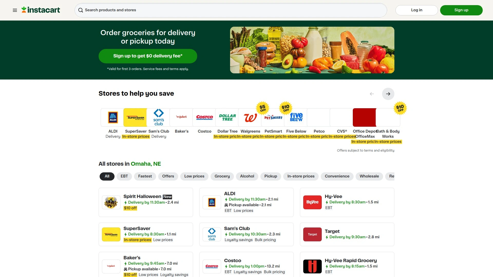
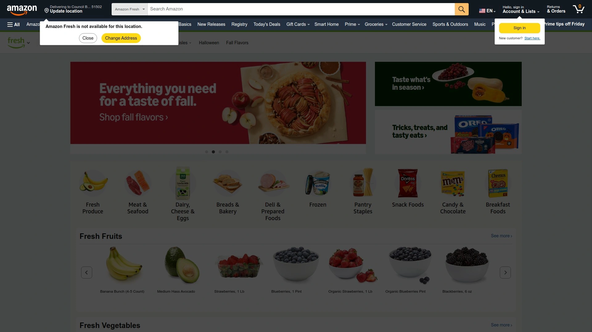
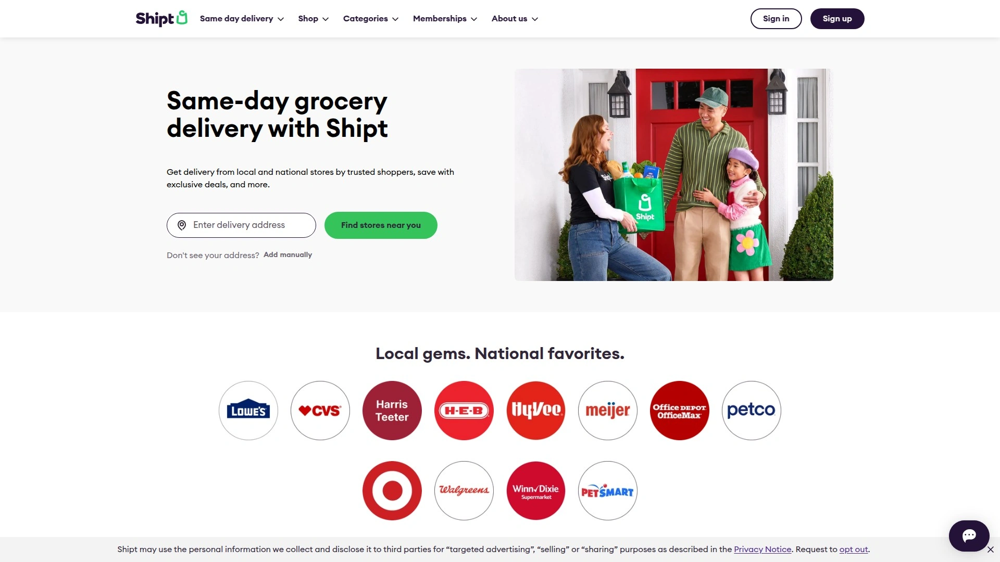
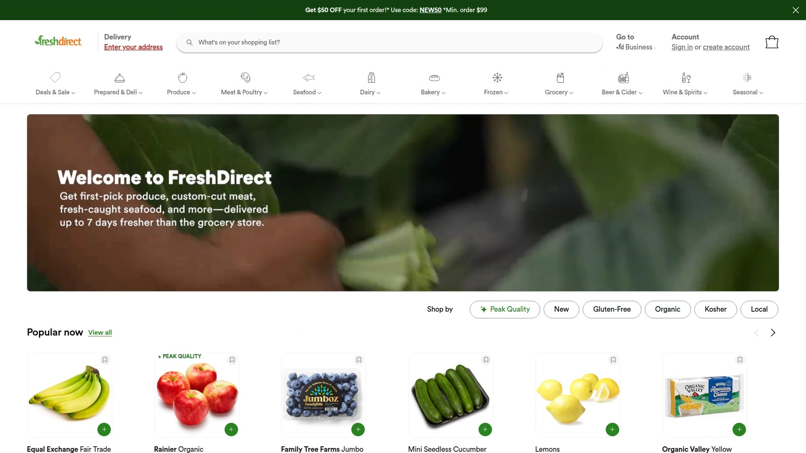
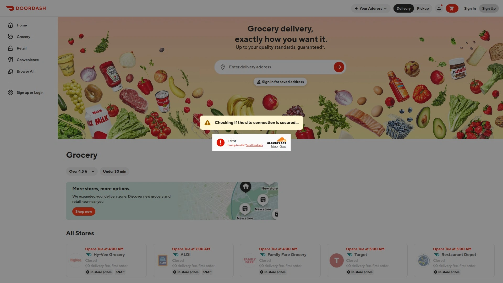
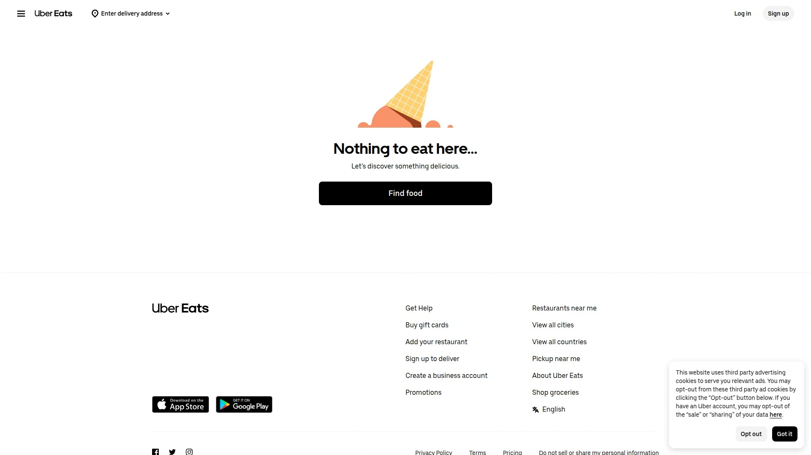

# No More Store Runs! Recommend 8 Same-Day Grocery Delivery Game-Changers!

Standing in grocery checkout lines after work feels like wasting time you don't have. Missing ingredients because the store ran out derails dinner plans. Hauling bags up stairs or through parking lots adds stress you'd rather skip. Same-day grocery delivery services solve these exact problems—letting you shop from your couch and have fresh food show up within hours. Whether you're juggling kids, working late shifts, or simply value your time, these platforms turn weekly grocery runs into a few taps on your phone.

## **[Instacart](https://instacart.com)**

Shop from 1,400+ local stores with same-day delivery and real-time shopper communication for fresh groceries you actually want.

Instacart connects you to basically every grocery store in your neighborhood. Type your ZIP code and see which chains operate nearby—Costco, Kroger, Publix, ALDI, Wegmans, CVS, whatever you usually shop at. Place orders through the app or website, then watch personal shoppers grab your items and bring them to your door in as little as one hour.

The platform works differently than warehouse-based services. Instead of stocking inventory themselves, Instacart sends shoppers to the actual stores where you'd normally go. This means you get the exact brands, products, and sales you're used to. Found a great deal at Sprouts this week? Order through Instacart and get those same sale prices.

**Real-time updates** keep you connected throughout the shopping process. Your assigned shopper messages you with photos when items are out of stock, suggesting alternatives for your approval. Don't like the replacement? Tell them to skip it. Want organic instead of conventional? Send a quick message. This back-and-forth mimics actually being there without leaving your home.

Delivery windows start as early as 9am and run until midnight depending on store hours. Schedule for later today, tomorrow, or up to five days ahead. Fast & Flexible delivery option lets Instacart match your order with the first available shopper, often arriving faster than scheduled windows. Tests show 85% of Fast & Flexible orders arrive in the earlier portion of estimated ranges, with 50% more available delivery slots compared to standard scheduling.

Instacart+ membership ($99 annually or $9.99 monthly) unlocks unlimited free delivery on orders over $35, reduced service fees, and no surge pricing during busy times. Without membership, expect delivery fees from $3.99 to $9.99 depending on order size and speed. Standard customers also pay 5-10% service fees. Heavy orders exceeding certain weight limits incur additional charges.

Payment flexibility covers credit, debit, gift cards, Buy Now Pay Later through Klarna, and SNAP EBT cards at participating locations. Before checkout, set substitution preferences for each item—approve automatic swaps, choose specific alternatives, or select "don't replace" if nothing else works. You're only charged for what actually gets delivered, with price differences refunded or added accordingly.

The contactless "Leave at my door" option drops groceries on your porch without face-to-face interaction. Track order progress live through the app, watching as your shopper moves through aisles and heads to your address. Instacart operates across the US and Canada, covering major cities and suburban areas through partnerships with national chains and local grocers.

Perfect for busy professionals who don't have time for store trips, parents managing kids and schedules, elderly folks with mobility challenges, or anyone who simply prefers spending Saturday mornings doing literally anything besides pushing carts through crowded aisles.

***

## **[Amazon Fresh](https://www.amazon.com/alm/storefront?almBrandId=QW1hem9uIEZyZXNo)**

Free same-day delivery for Prime members on thousands of groceries, household items, and Whole Foods 365 products in one seamless order.

Amazon Fresh brings the convenience you expect from Amazon to grocery shopping. Browse massive selections of fresh produce, meat, seafood, dairy, frozen foods, pantry staples, and household essentials—all organized clearly and easy to search. Because Amazon owns Whole Foods, you also get access to their 365 brand offering quality organic and specialty items at below-average prices.

**Same-day delivery** arrives for most orders placed before cutoffs, usually around noon or early afternoon depending on your location. Prime members get free delivery with no minimum in many areas, though some locations require $35 minimums. Non-Prime customers pay shipping fees that vary by region and speed.

The ordering platform integrates with your existing Amazon account, meaning no new logins or payment methods to set up. Add groceries to your cart alongside electronics, books, tools, or anything else Amazon sells. Checkout once and have everything arrive together. This consolidation saves time and reduces the number of deliveries you're juggling.

Inventory availability surpasses basic grocery apps. While fresh chicken thighs or fresh shrimp might be limited (frozen alternatives available), most staples you'd find at traditional supermarkets stock reliably. The produce selection covers essentials without overwhelming specialty varieties. All food arrives looking fresh with no spoiled or overripe items in testing.

In-store pickup operates in select ZIP codes, letting you order online and collect groceries at Amazon Fresh physical locations. The Summer store section features seasonal items and celebration supplies at discounted prices. Alexa voice shopping adds another convenience layer—"Alexa, add milk to my cart"—perfect when you're cooking and notice you're running low.

Amazon Fresh competes directly with Prime's other grocery option, Whole Foods delivery. The main difference: Fresh focuses on mainstream brands and everyday prices, while Whole Foods leans organic and premium. Choose based on your priorities and budget.

For households already subscribing to Prime ($139 annually), adding Fresh costs nothing extra. The selection, speed, and integration make it a natural extension of services you're already using. Particularly valuable for tech-savvy shoppers comfortable with Amazon's ecosystem who want grocery shopping to feel as smooth as ordering anything else online.

***

## **[Walmart Plus](https://www.walmart.com/plus)**

Unlimited free grocery delivery on orders over $35 with same-day service from the largest retail network in America.

Walmart Plus costs $98 annually or $13 monthly and removes delivery fees on grocery orders exceeding $35. Given that Walmart operates over 4,700 stores nationwide, chances are excellent you live near one, enabling quick same-day or next-day delivery depending on order timing and driver availability.

The membership includes more than just groceries. Free delivery extends to 160,000+ items across Walmart's entire inventory—electronics, home goods, toys, tools, pet supplies, pharmacy items. Basically if Walmart sells it, Plus delivers it free as long as your order hits that $35 threshold. For non-grocery purchases, there's no minimum at all.

**Gas discounts** add value beyond delivery. Save 5 cents per gallon at nearly 2,000 Walmart, Murphy USA, Sam's Club, and Murphy Express stations. If you drive regularly, this alone offsets a chunk of membership costs. Quick math: filling a 15-gallon tank weekly saves about $39 annually, covering 40% of the subscription.

Scan & Go feature works in physical stores, letting you scan items with the Walmart app as you shop and pay through Walmart Pay. Skip checkout lines entirely. Useful for quick in-store trips when delivery doesn't make sense or you need something immediately.

Ordering through the Walmart website or app shows in-store prices with no markups, unlike some delivery services that charge premiums on individual items. Specify delivery instructions before checkout—leave at door, ring doorbell, call when arriving. Walmart emails and texts throughout the process, including driver name and vehicle details for added security.

Substitutions happen when items are unavailable, though less communication occurs compared to Instacart's real-time shopper messaging. Walmart drivers are third-party contractors, not Walmart employees. Late-day orders (after 7-8pm) sometimes experience delays due to limited driver availability, occasionally pushing delivery to the following morning.

The generous free trial—15 days standard, sometimes extended to 30 days after quick surveys—lets you test the service without commitment. You'll see exactly how many days remain each time you log in, so surprise charges don't sneak up on you.

Best suited for budget-conscious families doing large weekly hauls, households near Walmart locations, or anyone who regularly shops Walmart anyway and wants to eliminate trips while saving on gas.

***

## **[Shipt](https://www.shipt.com)**

Target-owned delivery platform connecting you with personal shoppers who care about getting details right, from ripe avocados to specific brands.

Shipt operates similarly to Instacart—personal shoppers visit stores on your behalf—but the experience feels more personalized. Shoppers communicate throughout the process, asking about preferences and keeping you updated from start to finish. Want firm avocados that ripen in a few days? Slightly spotted bananas perfect for banana bread? Just tell your shopper and they'll pick accordingly.

**Over 100 local and national retailers** participate, including Target (Shipt's parent company), CVS, Harris Teeter, Publix, H-E-B, Meijer, Petco, Lowe's, Total Wine, Walgreens, 7-Eleven, and more. This variety means ordering groceries, pet supplies, hardware, and alcohol from multiple stores in one delivery.

Same-day delivery arrives within windows you select. Schedule for as fast as one hour or choose later times fitting your availability. Real-time updates track your shopper's progress. Two-way messaging handles last-minute changes, special requests, or clarifications about products.

Membership costs $99 annually (about $8.25 monthly) or $10.99 monthly for flexibility. Members get unlimited free delivery on orders over $35. Orders under $35 incur $7 fees. Alcohol purchases may add $7 alcohol fees depending on location. Students and SNAP EBT recipients qualify for 50%+ discounts on memberships, making the service accessible for tight budgets.

Target Circle 360 members receive exclusive benefits through Shipt including no price markups on most items (excluding select alcohol retailers). This partnership between Target and Shipt creates synergy for customers shopping Target regularly.

The 14-day free trial lets you test the service without upfront commitment. During trials, service operates identically to paid memberships—same stores, same delivery speed, same shopper quality. If it doesn't fit your needs, cancel before trial ends at no cost.

Shipt accepts SNAP EBT cards for eligible purchases, helping low-income households access the convenience of delivery. Built-in coupon recommender suggests personalized savings based on your shopping habits. Leave notes on specific items detailing exactly what you want.

Perfect for people who value personal touch and communication, households shopping at Target frequently, or anyone who appreciates shoppers who go the extra mile to get preferences exactly right. The emphasis on service quality over pure speed attracts customers prioritizing accuracy and care.

***

## **[FreshDirect](https://www.freshdirect.com)**

Premium grocery delivery featuring wide-ranging selection of fresh produce, quality meats, prepared foods, and timely service across the Northeast.

FreshDirect operates exclusively in the Northeast—serving New York, New Jersey, Connecticut, Pennsylvania, Delaware, and parts of Maryland and Massachusetts. If you live outside these areas, it won't help you. But for Northeast residents, it's arguably the best grocery delivery service available based on competitive prices, selection quality, and delivery reliability.

The selection spans fresh produce, meats, fish, prepared foods, pantry items, home products, and paper goods. Fewer total items than giant brick-and-mortar supermarkets, but comprehensive enough to cover typical grocery runs. Organic and specialty items stock at prices comparable to Stop & Shop or Wegmans.

**Website navigation** makes finding products intuitive. Categories organize logically, search functions work well, and filters help narrow choices. Deliveries arrive on time consistently based on extensive user testing. Customer service responds quickly and helpfully—if items are missing or damaged, they replace them in your next delivery or credit your account, no questions asked.

The food quality stands out. Fresh produce arrives looking crisp and appealing. Meats and fish meet high standards. Prepared foods taste better than most grocery store deli sections. This quality consistency keeps customers returning despite slightly higher prices than discount chains.

Delivery fees and minimums vary by location and order size. Membership options exist for frequent users, reducing per-delivery costs. Scheduling flexibility lets you choose specific delivery windows or same-day service when available.

One downside: occasional missing items from orders, though FreshDirect handles these issues promptly and fairly. Another limitation: geographic restriction to the Northeast means most US shoppers can't access it regardless of how good the service is.

FreshDirect targets quality-conscious consumers who care about food freshness and selection, busy professionals in dense Northeast metros, and families prioritizing meal quality over rock-bottom prices. If you're in their service area and value premium groceries delivered reliably, it's worth comparing against Instacart and other options.

***

## **[Gopuff](https://gopuff.com)**

Ultra-fast delivery of essentials, snacks, drinks, and basic groceries arriving in 30 minutes or less from micro-fulfillment centers.

Gopuff isn't a full grocery replacement—it's the service you use when you need things fast. Out of diapers at 9pm? Craving Ben & Jerry's right now? Need paper towels, cold medicine, and snacks for a last-minute movie night? Gopuff delivers in under an hour, often within 15-30 minutes.

The inventory focuses on convenience items: snacks, drinks, alcohol (21+ with ID check), household products, paper goods, pharmacy staples, baby essentials, pet food, and limited fresh groceries. You'll find fruits, vegetables, meat, and dairy, but selection is sparse and inconsistent compared to traditional grocery services.

**Speed is the selling point.** Gopuff operates over 500 micro-fulfillment centers across 650+ US cities. These small warehouses stock inventory close to customers, enabling rapid delivery. No waiting hours or scheduling days in advance—just order and receive shortly after.

Pricing stays fair with no delivery fees on most orders. Flat service fees apply instead, typically lower than what competitors charge. Products cost slightly more than in-store prices, but the premium for 30-minute delivery seems reasonable for urgent needs.

The platform delivers alcohol in many cities, making it useful for parties or gatherings when you realize you're short on drinks. Late-night availability exceeds traditional grocery services, with deliveries continuing well past midnight in many areas.

Limitations are obvious: limited fresh food options, inconsistent produce quality, small selection per category. Gopuff replaces emergency convenience store runs, not weekly grocery shopping. Don't expect to plan full meal ingredients or find specialty items.

Use Gopuff for last-minute essentials, emergency supplies, late-night cravings, or convenience items when time matters more than price or selection. It complements full grocery services rather than replacing them.

---

## **[DoorDash](https://www.doordash.com/grocery)**

Food delivery leader expanding into grocery with access to local stores and fast

 delivery times leveraging massive driver network.

DoorDash dominates restaurant delivery with over 60% market share. They've expanded into grocery delivery, applying the same logistics network to supermarkets, convenience stores, pet shops, and pharmacies. Order from places like Safeway, Walgreens, Petco, or local grocers through the DoorDash app.

**The driver network advantage** means orders often get picked up and delivered faster than services with fewer workers. DoorDash's massive scale creates availability even during odd hours or in suburban areas where smaller platforms struggle.

Pricing includes markups on grocery items, delivery fees, service fees, and suggested tips. Research shows DoorDash charges some of the highest premiums among grocery delivery apps—33%+ markups compared to in-store shopping. The convenience costs notably more than competitors like Instacart or Uber Eats.

DashPass membership ($9.99 monthly) waives delivery fees on orders over $12 from eligible stores. Members still pay service fees and item markups. For frequent users ordering multiple times weekly, the subscription pays for itself. Occasional users might find pay-per-delivery cheaper.

Real-time tracking shows driver location as they pick up and deliver orders. Communication with drivers is limited compared to Instacart shoppers—no real-time substitution discussions or product quality consultations. You get what the driver grabs.

The app interface works smoothly since DoorDash invested heavily in user experience. Adding items, modifying orders, and checking out feels polished and quick. Familiarity from restaurant ordering transfers to grocery shopping without learning new systems.

Best for households already using DoorDash regularly who want to consolidate apps, people valuing fast delivery over lowest prices, or those living in areas where driver availability from other services is spotty.

***

## **[Uber Eats](https://www.ubereats.com/category/grocery)**

Restaurant delivery giant bringing grocery shopping into the same app with competitive pricing and extensive store partnerships.

Uber Eats leverages Uber's existing driver network to deliver groceries alongside restaurant meals. Order from grocery chains, convenience stores, specialty shops, and pharmacies through the familiar Uber Eats interface.

**Pricing competitiveness** makes Uber Eats attractive for grocery delivery. Research comparing major platforms found Uber Eats charges 25% markups—second lowest behind Instacart's 24%. The $1.99 delivery fee is often cheaper than competitors. Service fees run 5-10% depending on order size.

Uber One membership ($9.99 monthly or $99 annually) includes benefits across both Uber rideshare and Uber Eats. Members get $0 delivery fees and reduced service fees on orders over minimums. For people using Uber for transportation anyway, bundling makes financial sense.

The app combines restaurant and grocery ordering in one place. Browse nearby grocery stores, add items to your cart, check out, and track delivery. Same interface whether you're ordering sushi or milk—reducing friction for users managing multiple needs.

Delivery speed varies based on driver availability and distance. Urban areas typically see faster service than rural locations. Scheduling options let you choose specific time windows or immediate delivery depending on urgency.

Store selection includes major chains and local grocers, though availability varies significantly by location. Check your area to see which stores participate before committing to regular Uber Eats grocery usage.

The main advantage over standalone grocery apps: convenience of one app for multiple delivery types. If you're already ordering meals through Uber Eats and using Uber rides, adding groceries completes your delivery ecosystem without downloading additional apps.

## Common Questions

**Which grocery delivery service offers the lowest fees?**
Instacart and Uber Eats show the smallest markups at 24-25% compared to in-store shopping, according to independent research. Walmart Plus provides the best value for frequent users since unlimited free delivery costs just $98 annually. Amazon Fresh is essentially free if you already subscribe to Prime. Compare your specific usage patterns against membership costs to find your best option.

**Can I use SNAP EBT benefits for grocery delivery?**
Yes. Instacart accepts SNAP EBT cards at participating stores. Amazon Fresh allows EBT payments for eligible items. Walmart Plus works with EBT for grocery purchases. Shipt also supports SNAP payments. Check each platform's specific store partnerships since EBT acceptance varies by retailer even within the same delivery service.

**How do I handle out-of-stock items during delivery?**
Instacart and Shipt offer real-time communication where shoppers message you with replacement options when items are unavailable. You approve or reject substitutions during shopping. Services like Walmart Plus, Amazon Fresh, and DoorDash use preset preferences—you configure automatic substitution rules before checkout, and drivers or warehouse workers follow those guidelines without direct communication.

***

## Skip the Checkout Lines

Grocery delivery transforms weekly chores into simple phone taps. Whether you're ordering bulk staples through Walmart Plus, grabbing emergency snacks via Gopuff, or selecting organic produce through FreshDirect, these platforms eliminate the time sink and stress of traditional shopping. Your Saturday mornings are yours again—no parking lot battles, no cart traffic jams, no forgetting items because you left the list at home.

[Instacart](https://instacart.com) excels for shoppers wanting maximum flexibility and real-time control over their orders. The access to 1,400+ stores means shopping at your preferred retailers without leaving home, while personal shoppers provide communication and care that automated systems can't match. For families juggling busy schedules or anyone who values both convenience and quality assurance, Instacart delivers exactly what you need, exactly how you want it.
